<!-- 
  ╔══════════════════════════════════════════════════════════════╗
  ║                  🌌 DEVELOPER SCOREBOARD                    ║
  ║          Deep Blue Themed GitHub Profile README              ║
  ╚══════════════════════════════════════════════════════════════╝
-->

<div align="center">

<!-- ==================== HEADER BANNER ==================== -->


<br/>

<!-- ==================== ABOUT ME ==================== -->

<table>
<tr>
<td width="50%">

### 🎯 About Me

```yaml
name: "Your Name"
title: "Full-Stack Developer"
location: "Earth 🌍"
education: "Computer Science"
current_focus: "Building amazing things"
fun_fact: "I turn ☕ into <code/>"
```

</td>
<td width="50%">

### 🏅 Achievements

| Badge | Description |
|:---:|:---|
| 🏆 | **A+ Developer Rating** |
| ⚡ | **Top 5% Contributors** |
| 🔥 | **365-Day Streak** |
| 🌟 | **2.4K+ Stars Earned** |
| 🚀 | **50+ Projects Shipped** |

</td>
</tr>
</table>

<br/>

<!-- ==================== GITHUB STATS ==================== -->



<br/><br/>

<!-- ==================== SKILLS RATING ==================== -->



<br/><br/>

<!-- ==================== RADAR CHART + ACTIVITY ==================== -->

<table>
<tr>
<td width="50%" align="center">



</td>
<td width="50%">

### 📊 Activity Breakdown

```text
Code Review    ████████████████░░░░  80%
Feature Dev    ███████████████░░░░░  75%
Bug Fixing     ████████████░░░░░░░░  60%
Documentation  ██████████░░░░░░░░░░  50%
Open Source     █████████████████░░░  85%
Mentoring      ████████████░░░░░░░░  60%
```

### 🔗 Connect

[](https://github.com/sunruize93-cmyk)
[](https://linkedin.com/in/sunruize93-cmyk)
[](https://twitter.com/sunruize93-cmyk)

</td>
</tr>
</table>

<br/>

<!-- ==================== CONTRIBUTION GRAPH ==================== -->


<br/>

<!-- ==================== FOOTER ==================== -->


<sub>🌌 Crafted with passion | Last updated: 2026</sub>

</div>
